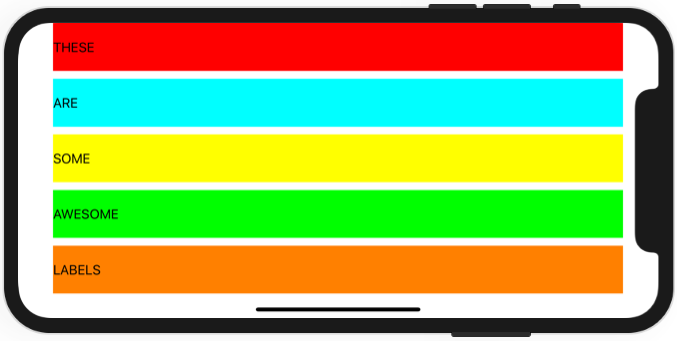

# Project 6 - Auto Layout

https://www.hackingwithswift.com/100/30

Includes solutions to the [challenges](https://www.hackingwithswift.com/read/6/6/wrap-up).

This project is divided in [Project 6a](Project6a/) and [Project 6b](Project6b/).

## Topics

Auto Layout, Constraints, Visual Format Language

## Challenges

>1. [Challenge 1](Project6b/)
>2. [Challenge 2](Project6b/)
>3. [Challenge 3](Project6b/)

## Screenshots

