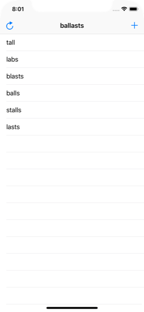

# Project 5 - Word Scramble

https://www.hackingwithswift.com/100/27

Includes solutions to the [challenges](https://www.hackingwithswift.com/read/5/7/wrap-up).

## Topics

Reading from disk, UIAlertController, IndexPath

## Challenges

From [Hacking with Swift](https://www.hackingwithswift.com/read/5/7/wrap-up):
>1. Disallow answers that are shorter than three letters or are just our start word. For the three-letter check, the easiest thing to do is put a check into isReal() that returns false if the word length is under three letters. For the second part, just compare the start word against their input word and return false if they are the same.
>2. Refactor all the else statements we just added so that they call a new method called showErrorMessage(). This should accept an error message and a title, and do all the UIAlertController work from there.
>3. Add a left bar button item that calls startGame(), so users can restart with a new word whenever they want to.
>
>Bonus: Once you’ve done those three, there’s a really subtle bug in our game and I’d like you to try finding and fixing it.
>
>To trigger the bug, look for a three-letter word in your starting word, and enter it with an uppercase letter. Once it appears in the table, try entering it again all lowercase – you’ll see it gets entered. Can you figure out what causes this and how to fix it?

## Screenshots

