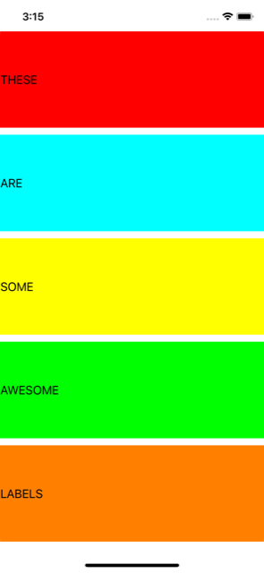
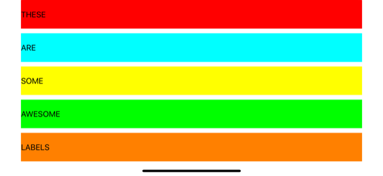

# Project 6b

https://www.hackingwithswift.com/read/6/3/auto-layout-in-code-addconstraints-with-visual-format-language

Includes solutions to the challenges from [Project6b](https://www.hackingwithswift.com/read/6/6/wrap-up).

## Screenshots

