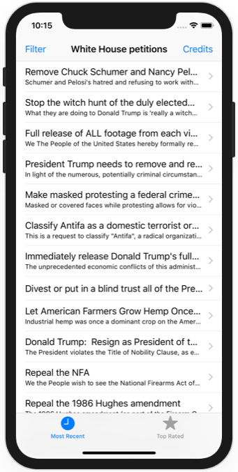
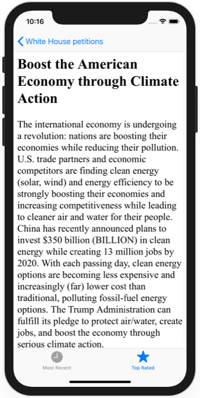

# Project 9 Challenge 3

https://www.hackingwithswift.com/read/7/6/wrap-up

## Challenge

From [Hacking with Swift](https://www.hackingwithswift.com/read/9/6/wrap-up):
>Modify project 7 so that your filtering code takes place in the background. This filtering code was added in one of the challenges for the project, so hopefully you didn’t skip it!

## Screenshots

