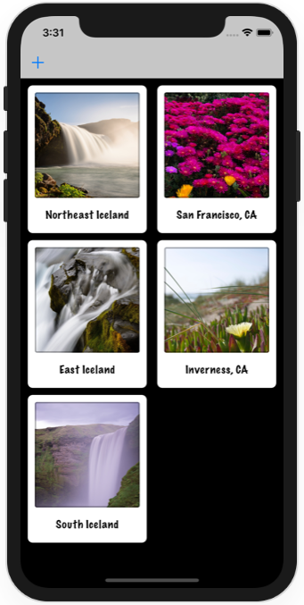

# Project 12a - User Defaults

https://www.hackingwithswift.com/read/12/3/fixing-project-10-nscoding

Bonus:
- Use background thread for saving
- Save on deletion

## Topics

UserDefaults, JSON, NSCoding

## Screenshots

