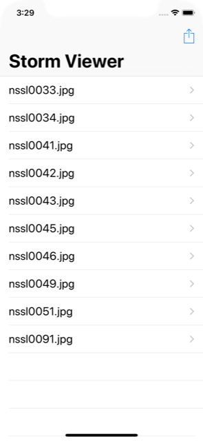
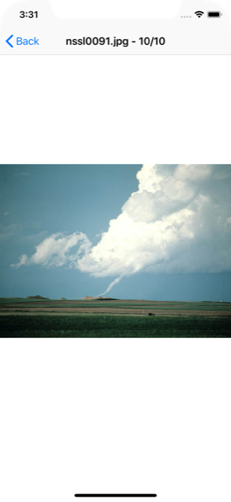

# Project 9 Challenge 1

https://www.hackingwithswift.com/read/9/6/wrap-up

## Challenge

From [Hacking with Swift](https://www.hackingwithswift.com/read/9/6/wrap-up):
>Modify project 1 so that loading the list of NSSL images from our bundle happens in the background. Make sure you call reloadData() on the table view once loading has finished!

## Screenshots

