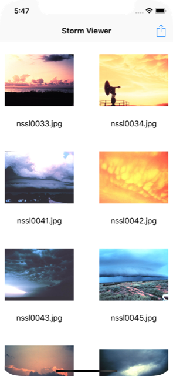

# Project 10 Challenge 3

https://www.hackingwithswift.com/read/10/7/wrap-up

## Challenge

From [Hacking with Swift](https://www.hackingwithswift.com/read/10/7/wrap-up):
>Modify project 1 so that it uses a collection view controller rather than a table view controller. I recommend you keep a copy of your original table view controller code so you can refer back to it later on.

## Screenshots

