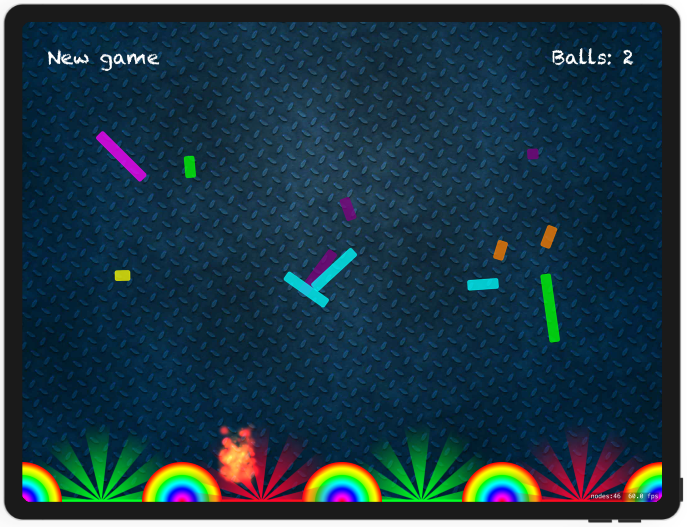

# Project 11 - Pachinko

https://www.hackingwithswift.com/100/45

Includes solutions to the [challenges](https://www.hackingwithswift.com/read/11/8/wrap-up).

Bonus:
- different fire color depending on slot
- automated randomized boxes with new game instead of edit

## Topics

SpriteKit, Nodes, UITouch, Physics Body, SKAction, Collisions, Emitters

## Challenges

From [Hacking with Swift](https://www.hackingwithswift.com/read/11/8/wrap-up):
>1. The pictures we’re using in have other ball pictures rather than just “ballRed”. Try writing code to use a random ball color each time they tap the screen.
>2. Right now, users can tap anywhere to have a ball created there, which makes the game too easy. Try to force the Y value of new balls so they are near the top of the screen.
>3. Give players a limit of five balls, then remove obstacle boxes when they are hit. Can they clear all the pins with just five balls? You could make it so that landing on a green slot gets them an extra ball.

## Screenshots

