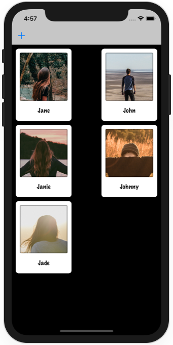

# Project 12a

https://www.hackingwithswift.com/read/12/3/fixing-project-10-nscoding

Pictures from [@valentinantonini](https://unsplash.com/@valentinantonini), [@worldsbetweenlines](https://unsplash.com/@worldsbetweenlines), [@t_rampersad](https://unsplash.com/@t_rampersad), [@alexwoods](https://unsplash.com/@alexwoods), [@artemkovalev](https://unsplash.com/@artemkovalev)

Bonus:
- Use background thread for saving
- Save on deletion

## Screenshots

