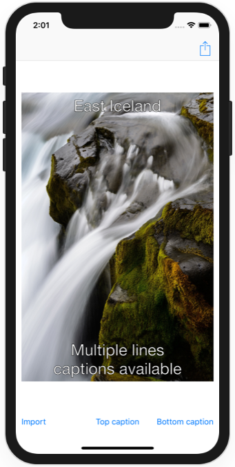

# Milestone Projects 25-27 - Meme Generator

https://www.hackingwithswift.com/100/90

## Challenge

From [Hacking with Swift](https://www.hackingwithswift.com/guide/10/3/challenge):
>Your challenge for this milestone is to create a meme generation app using UIImagePickerController, UIAlertController, and Core Graphics. If you aren’t familiar with them, memes are a simple format that shows a picture with one line of text overlaid at the top and another overlaid at the bottom.
>
>Your app should:
>
>- Prompt the user to import a photo from their photo library.
>- Show an alert with a text field asking them to insert a line of text for the top of the meme.
>- Show a second alert for the bottom of the meme.
>- Render their image plus both pieces of text into one finished UIImage using Core Graphics.
>- Let them share that result using UIActivityViewController.
>
>Both the top and bottom pieces of text should be optional; the user doesn’t need to provide them if they don’t want to.
>
>Try to solve the challenge now. As per usual, there are some hints below in case you hit problems.
>
>1. Your UI can be pretty simple: a large image view, with three buttons below: Import Picture, Set Top Text, and Set Bottom Text.
>2. Both pieces of text can be read in using a UIAlertController with a text field inside.
>3. When rendering your finished image, make sure you draw your UIImage first, then add the text on top.
>4. NSAttributedString has keys to specify the stroke width and color of text, which would make it more readable – can you experiment to figure it out?

## Screenshots

