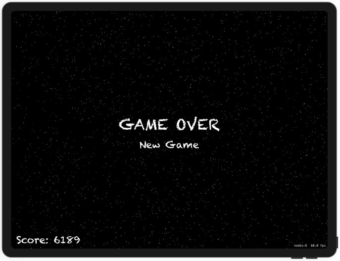

# Project 17 - Space Race

https://www.hackingwithswift.com/100/62

Includes solutions to the [challenges](https://www.hackingwithswift.com/read/17/5/wrap-up).

Bonus:
- New game option

## Topics

Collisions, Timer, Linear / Angular damping

## Challenges

From [Hacking with Swift](https://www.hackingwithswift.com/read/17/5/wrap-up):
>1. Stop the player from cheating by lifting their finger and tapping elsewhere – try implementing touchesEnded() to make it work.
>2. Make the timer start at one second, but then after 20 enemies have been made subtract 0.1 seconds from it so it’s triggered every 0.9 seconds. After making 20 more, subtract another 0.1, and so on. Note: you should call invalidate() on gameTimer before giving it a new value, otherwise you end up with multiple timers.
>3. Stop creating space debris after the player has died.

## Screenshots

