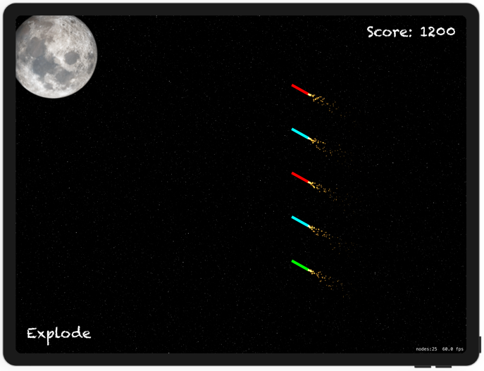

# Project 20

https://www.hackingwithswift.com/100/70

Includes solutions to the [challenges](https://www.hackingwithswift.com/read/20/5/wrap-up).

Bonus:
- Add explode button as an alternative to shake
- Add game over and restart functions

## Topics

UIBezierPath, SKAction follow, Emitter nodes

## Challenges

From [Hacking with Swift](https://www.hackingwithswift.com/read/20/5/wrap-up):
>1. For an easy challenge try adding a score label that updates as the player’s score changes.
>2. Make the game end after a certain number of launches. You will need to use the invalidate() method of Timer to stop it from repeating.
>3. Use the waitForDuration and removeFromParent actions in a sequence to make sure explosion particle emitters are removed from the game scene when they are finished.

## Screenshots

