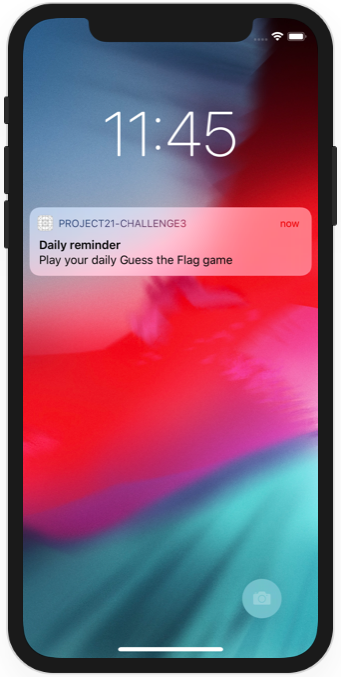

# Project 21 Challenge 3

https://www.hackingwithswift.com/read/21/4/wrap-up

Bonus:
- Display message before requesting notifications authorization
- Display message explaining how to authorize notifications if they have been denied

## Challenge

And for an even harder challenge, update project 2 so that it reminds players to come back and play every day. This means scheduling a week of notifications ahead of time, each of which launch the app. When the app is finally launched, make sure you call removeAllPendingNotificationRequests() to clear any un-shown alerts, then make new alerts for future days.

## Screenshots

