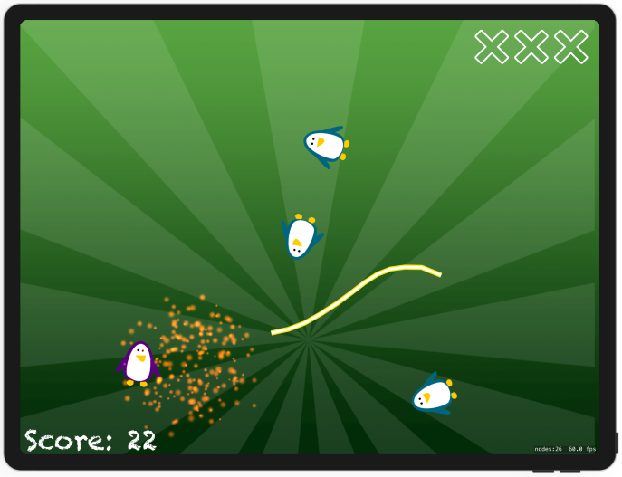
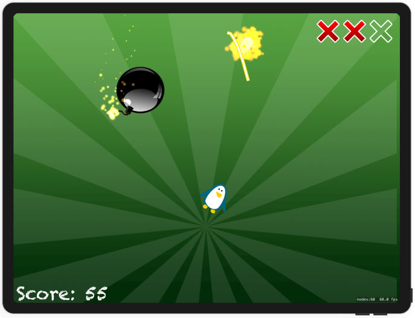

# Project 23

https://www.hackingwithswift.com/100/77

Includes solutions to the [challenges](https://www.hackingwithswift.com/read/23/8/wrap-up).

Bonus:
- New game option

## Challenges

From [Hacking with Swift](https://www.hackingwithswift.com/read/23/8/wrap-up):
>1. Try removing the magic numbers in the createEnemy() method. Instead, define them as constant properties of your class, giving them useful names.
>2. Create a new, fast-moving type of enemy that awards the player bonus points if they hit it.
>3. Add a “Game over” sprite node to the game scene when the player loses all their lives.

## Screenshots

