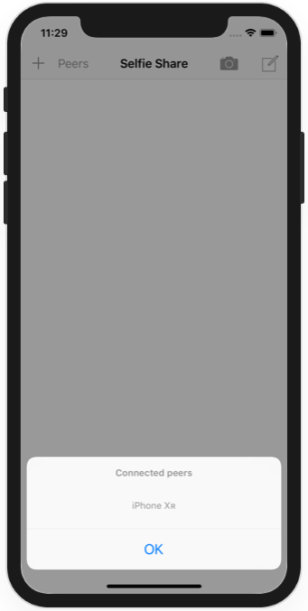
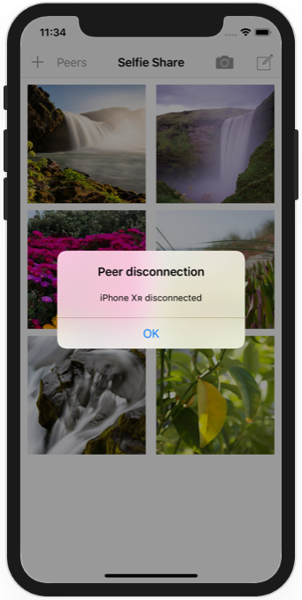

# Project 25

https://www.hackingwithswift.com/100/83

Includes solutions to the [challenges](https://www.hackingwithswift.com/read/25/5/wrap-up).

## Challenges

From [Hacking with Swift](https://www.hackingwithswift.com/read/25/5/wrap-up):
>1. Show an alert when a user has disconnected from our multipeer network. Something like “Paul’s iPhone has disconnected” is enough.
>2. Try sending text messages across the network. You can create a Data from a string using Data(yourString.utf8), and convert a Data back to a string by using String(decoding: yourData, as: UTF8.self).
>3. Add a button that shows an alert controller listing the names of all devices currently connected to the session – use the connectedPeers property of your session to find that information.

## Screenshots

