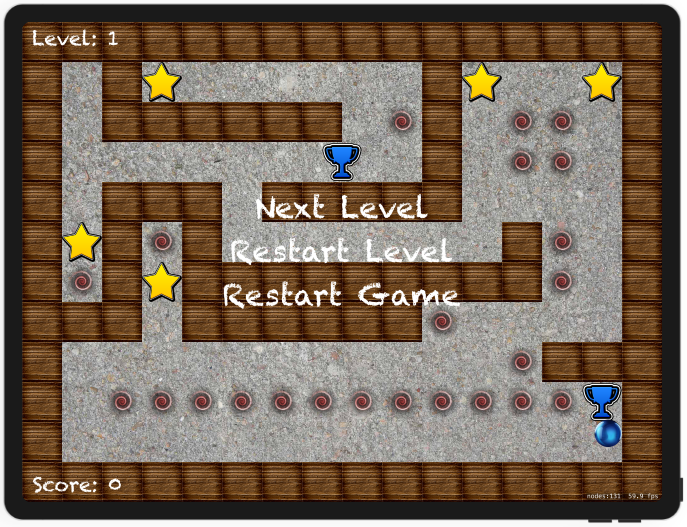

# Project 26

https://www.hackingwithswift.com/100/85

Includes solutions to the [challenges](https://www.hackingwithswift.com/read/26/5/wrap-up).

Portal assets under [CC0 License](https://creativecommons.org/publicdomain/zero/1.0/legalcode) thanks to [Mumu](https://opengameart.org/content/shiny-orbs-64x64).

## Challenges

1. Rewrite the loadLevel() method so that it's made up of multiple smaller methods. This will make your code easier to read and easier to maintain, or at least it should do if you do a good job!
2. When the player finally makes it to the finish marker, nothing happens. What should happen? Well, that's down to you now. You could easily design several new levels and have them progress through.
3. Add a new block type, such as a teleport that moves the player from one teleport point to the other. Add a new letter type in loadLevel(), add another collision type to our enum, then see what you can do.

## Screenshots

