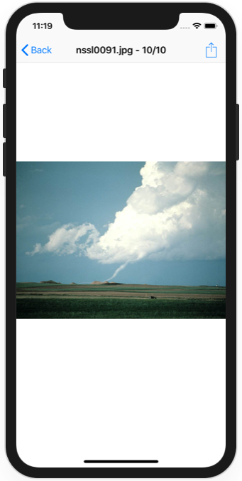

# Project 27 Challenge 3

https://www.hackingwithswift.com/read/27/7/wrap-up

## Challenge

Go back to project 3 and change the way the selected image is shared so that it has some rendered text on top saying “From Storm Viewer”. This means reading the size property of the original image, creating a new canvas at that size, drawing the image in, then adding your text on top.

## Screenshots

