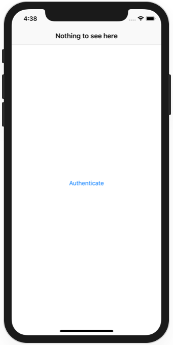
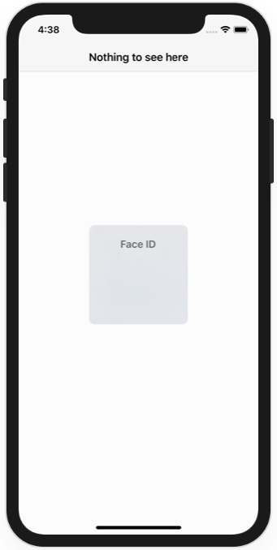
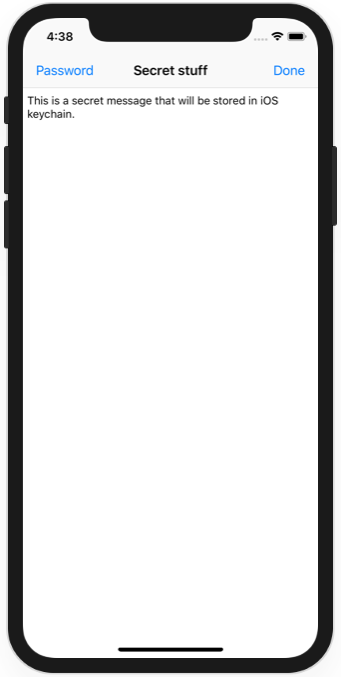
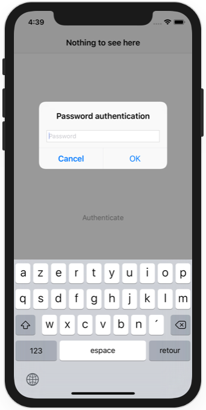

# Project 28

https://www.hackingwithswift.com/100/92

Includes solutions to the [challenges](https://www.hackingwithswift.com/read/28/5/wrap-up).

## Challenges

1. Add a Done button as a navigation bar item that causes the app to re-lock immediately rather than waiting for the user to quit. This should only be shown when the app is unlocked.
2. Create a password system for your app so that the Touch ID/Face ID fallback is more useful. You'll need to use an alert controller with a text field like we did in project 5, and I suggest you save the password in the keychain!
3. Coming soon

## Screenshots

