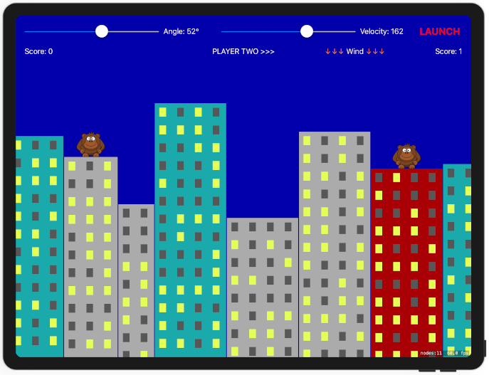
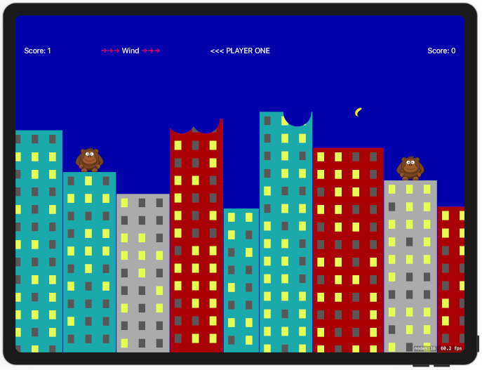
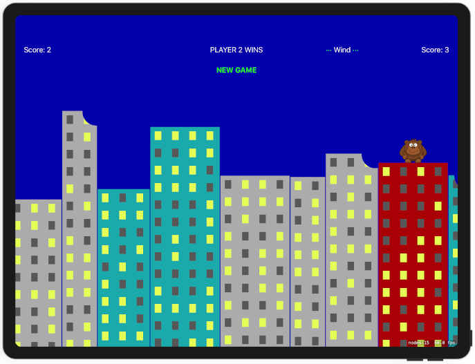

# Project 29

https://www.hackingwithswift.com/100/94

Includes solutions to the [challenges](https://www.hackingwithswift.com/read/29/6/wrap-up).

## Challenges

1. Add code and UI to track the player scores across levels, then make the game end after one player has won three times.
2. Add Auto Layout rules for the UI components in our storyboard, allowing them to remain positioned neatly regardless of which iPad size is used.
3. Use the physics world’s gravity to add random wind to each level, making sure to add a label telling players the direction and strength.

## Screenshots

