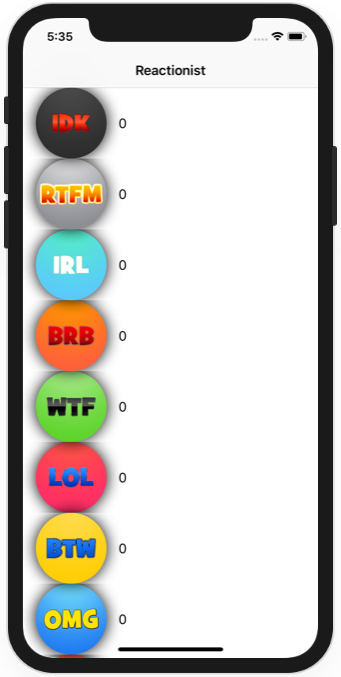

# Project 30

https://www.hackingwithswift.com/100/97

Includes solutions to the [challenges](https://www.hackingwithswift.com/read/30/7/wrap-up).

## Challenges

1. Go through project 30 and remove all the force unwraps. Note: implicitly unwrapped optionals are not the same thing as force unwraps – you’re welcome to fix the implicitly unwrapped optionals too, but that’s a bonus task.
2. [Challenge 2](../60-Project30-Challenge2)
3. Coming soon

## Screenshots

