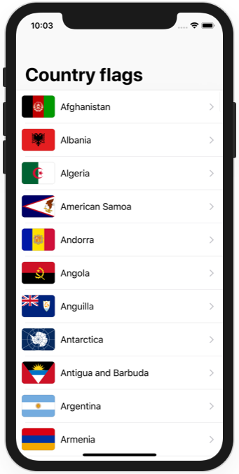
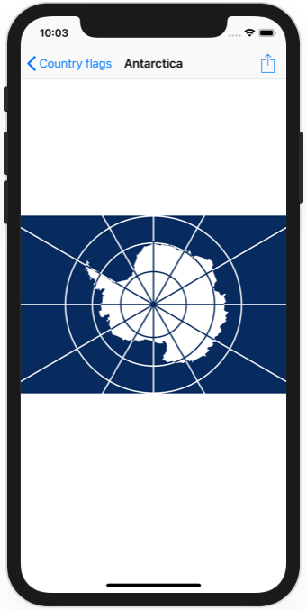

# Project 30 Challenge 2

https://www.hackingwithswift.com/read/30/7/wrap-up

Bonus: improve scrolling performance

## Challenge

Pick any of the previous 29 projects that interests you, and try exploring it using the Allocations instrument. Can you find any objects that are persistent when they should have been destroyed?

## Screenshots

