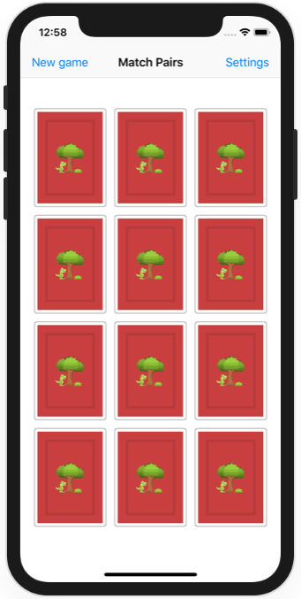
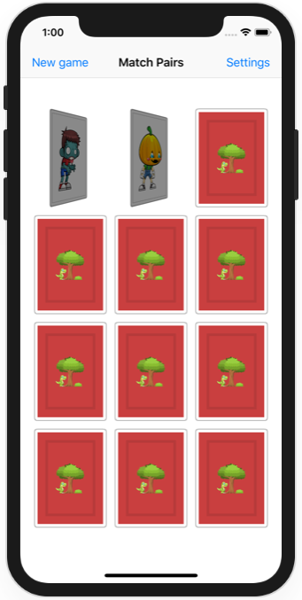
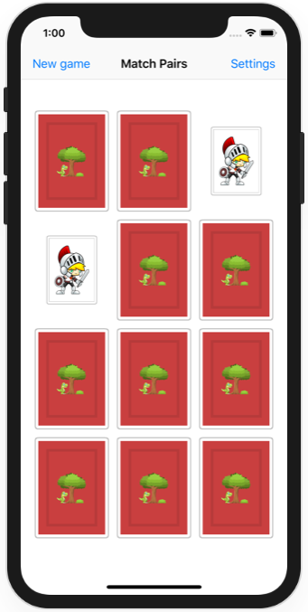
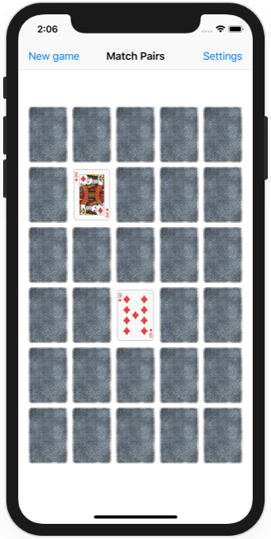
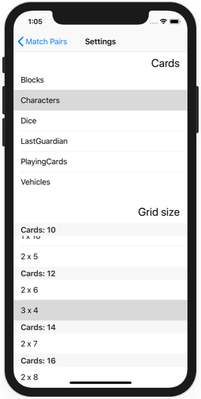

# Milestone Projects 28-30

https://www.hackingwithswift.com/100/99

Focus for this one has been put on cards fitting every screen size and orientation, and animation. Number and type of cards are customizable. 

Blocks assets under [CC0 License](https://creativecommons.org/publicdomain/zero/1.0/legalcode) thanks to [Kenney](https://www.kenney.nl/assets/isometric-blocks). Characters assets under [CC0 License](https://creativecommons.org/publicdomain/zero/1.0/legalcode) thanks to [Game Art 2D](https://www.gameart2d.com/freebies.html). Dice, vehicle and part of back of the cards assets under [CC0 License](https://creativecommons.org/publicdomain/zero/1.0/legalcode) thanks to [Kenney](https://www.kenney.nl/assets/boardgame-pack). Last Guardian characters assets under [CC attribution 3.0](https://creativecommons.org/licenses/by/3.0/legalcode) thanks to [Philipp Lenssen](http://blogoscoped.com/archive/2006-08-08-n51.html). Playing cards assets under [CC attribution-sharealike 4.0](https://creativecommons.org/licenses/by-sa/4.0/legalcode) thanks to [minime453](https://opengameart.org/content/vintage-playing-cards?page=3).

## Challenge

>Your challenge is to create a memory pairs game that has players find pairs of cards – it’s sometimes called Concentration, Pelmanism, or Pairs. At the very least you should:
>
>- Come up with a list of pairs. Traditionally this is two pictures, but you could also use capital cities (e.g. one card says France and its match says Paris), languages (e.g one card says “hello” and the other says “bonjour”), and so on.
>- Show a grid of face-down cards. How many is down to you, but if you’re targeting iPad I would have thought 4x4 or more.
>- Let the player select any two cards, and show them face up as they are tapped.
>- If they match remove them; if they don’t match, wait a second then turn them face down again.
>- Show a You Win message once all are matched.
>
>You can use either SpriteKit or UIKit depending on which skill you want to practice the most, but I think you’ll find UIKit much easier.
>
>Don’t under-estimate this challenge! To make it work you’re going to need to draw on a wide variety of skills, and it will push you. That’s the point, though, so take your time and give yourself space to think.
>
>If you’re looking for a more advanced challenge, go for a variant of the game that uses word pairs and add a parental option that lets them create new cards. This would mean:
>
>- Authenticating users using Touch ID or Face ID.
>- Showing a new view controller that lists all existing cards and lets them enter a new card.
>- You can use a UIAlertController with one or two text fields for your card entry, depending on what kind of game you’ve made.
>
>Please go ahead and try to solve the challenge now. My hints are below, but please try to avoid reading them unless you’re really struggling.
>
>- Start small. Seriously! Find something really simple that works, and only try something bigger or better once your simplest possible solution actually works.
>- If you’re using UIKit, you could try to solve this using a UICollectionView. This gives you a natural grid, as well as touch handling for selecting cells, but make sure you think carefully about cells being re-used – this might prove more difficult than you thought.
>- An easier approach is to lay out your cards much like we did with the word letters in project 8, 7 Swifty Words. You could show your card backs as a button image, then when the button is tapped show the other side of the card – which might be as simple as changing the picture and making the button’s text label have a non-clear color, or perhaps using Core Graphics to render the text directly onto the card front image.
>- If you made the buttons work and want to try something fancier, you can actually create a flip animation to toggle between views – see my article How to flip a UIView with a 3D effect: transition(with:) for more information.
>- In terms of tracking the game state it really only has three states: player has chosen zero cards, player has chosen one card (flip it over), and player has chosen two cards (flip the second one over). When they’ve chosen two cards you need to decide whether you have a match, then either remove the cards or flip them back down and go back to the first state.
>- For the content to show, you can just type in a list of words/images into your code if you want, but you’re welcome to use Codable if you want to push yourself.

## Screenshots

