# 100-days-of-swift

Solutions to Paul Hudson's "100 days of Swift" projects and challenges.

https://www.hackingwithswift.com/100

## Completion status

Type               | Number  | Completion
:---               |  :---:  |   :---:
Projects           | 30 / 30 | 100%
Challenges         | 90 / 90 | 100%
Milestone Projects |  9 / 10 | 90%
Other              |  1 / 1  | 100%

## Preview

*Within each project are larger versions of the screenshots.*

Projects / Topics                                                                                                                                                            | Screenshots
---                                                                                                                                                                          |---
[Project 1](01-Project1) (with challenges)                                           View controllers, Storyboard, FileManager                                |   |
[Project 2](02-Project2) (with challenges)                                           UIButton, CALayer, IBAction                                              |  |
[Project 3](03-Project3) (with challenge 1) (base: project 1)                        UIBarButtonItem, UIActivityController                                    |   |
[Project 3 - Challenge 2](04-Project3-Challenge2) (base: project 1)                                                                                           | 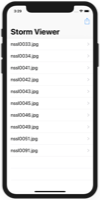  |
[Project 3 - Challenge 3](05-Project3-Challenge3) (base: project 2)                                                                                           |  |
[Milestone projects 1-3](06-Milestone-Projects1-3)                                                                                                            | 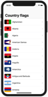  |
[Project 4](07-Project4) (with challenges)                                           WKWebView, Action sheets, UIToolbar, UIProgressView                      |   |
[Project 5](08-Project5) (with challenges)                                           Reading from disk, UIAlertController, IndexPath                          |  |
[Project 6a](09-Project6a) (base: project 2)                                         Auto Layout, Constraints, Visual Format Language                         | 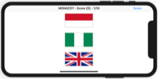 |
[Project 6b](10-Project6b) (with challenges)                                         Auto Layout, Constraints, Visual Format Language                         | 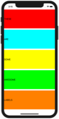 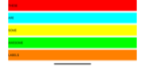 |
[Milestone projects 4-6](11-Milestone-Projects4-6)                                                                                                            | 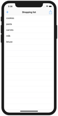 |
[Project 7](12-Project7) (with challenges)                                           UITabBarController, JSON, Data, Codable                                  |   |
[Project 8](13-Project8) (with challenges)                                           UI in code, Text alignment, Layout Margins, UIFont                       | 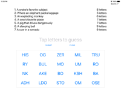 |
[Project 9](14-Project9) (base: project 7)                                           Grand Central Dispatch, PerformSelector                                  |   |
[Project 9 - Challenge 1](15-Project9-Challenge1) (base: project 1)                                                                                           | 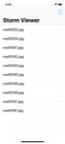  |
[Project 9 - Challenge 2](16-Project9-Challenge2) (base: project 8)                                                                                           |  |
[Project 9 - Challenge 3](17-Project9-Challenge3) (base: project 7)                                                                                           |   |
[Milestone projects 7-9](18-Milestone-Projects7-9)                                                                                                            | 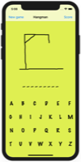  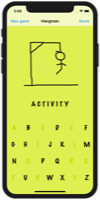 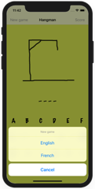 |
[Project 10](19-Project10) (with challenges 1 and 2)                                 UICollectionView, UIImagePickerController, NSObject                      |  |
[Project 10 - Challenge 3](20-Project10-Challenge3) (base: project 1)                                                                                         | 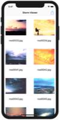 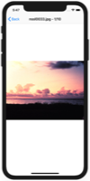 |
[Project 11](21-Project11)  (with challenges)                                        SpriteKit, Nodes, UITouch, Physics Body, SKAction, Collisions, Emitters  | 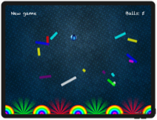 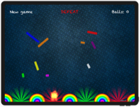 |
[Project 12](22-Project12)                                                                                                                                    | No screenshot |
[Project 12a](23-Project12a) (base: project 10)                                      UserDefaults, JSON, NSCoding                                             |  |
[Project 12b](24-Project12b) (base: project 10)                                      UserDefaults, JSON, Codable                                              | 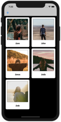 |
[Project 12 - Challenge 1](25-Project12-Challenge1) (base: project 1)                                                                                         | 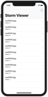  |
[Project 12 - Challenge 2](26-Project12-Challenge2) (base: project 2)                                                                                         |  |
[Project 12 - Challenge 3](27-Project12-Challenge3) (base: project 5)                                                                                         | 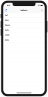 |
[Milestone projects 10-12](28-Milestone-Projects10-12)                                                                                                        |   |
[Project 13](29-Project13) (with challenges)                                         UISlider, UIImagePickerController, CIContext, CIFilter, Saving photos    | 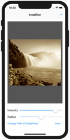  |
[Project 14](30-Project14) (with challenges)                                         SKCropNode, SKTexture, SKAction                                          | 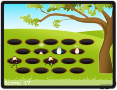  |
[Project 15](31-Project15)                                                           Animation, CGAffineTransform                                             | 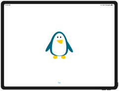 |
[Project 15 - Challenge 1](32-Project15-Challenge1) (base: project 8)                                                                                         | 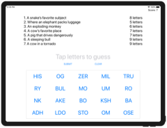 |
[Project 15 - Challenge 2](33-Project15-Challenge2) (base: project 13)                                                                                        |  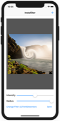 |
[Project 15 - Challenge 3](34-Project15-Challenge3) (base: project 2)                                                                                         | 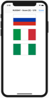 |
[Milestone projects 13-15](35-Milestone-Projects13-15)                                                                                                        | 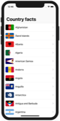 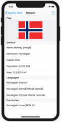 |
[Project 16](36-Project16) (with challenges)                                         MapKit, MKMapView, MKAnnotation, CLLocationCoordinate2D                   | 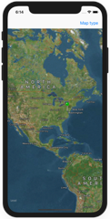   |
[Project 17](37-Project17) (with challenges)                                         Collisions, Timer, Linear / Angular damping                              |  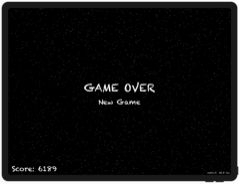 |
[Project 18](38-Project18)                                                           Debugging                                                                | No screenshot |
[Project 18 - Challenge 1-2](39-Project18-Challenges1-2) (base: project 1)                                                                                    | 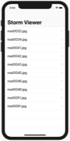 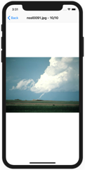 |
[Milestone projects 16-18](40-Milestone-Projects16-18)                                                                                                        |   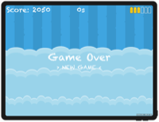 |
[Project 19](41-Project19) (with challenges)                                         Safari Extensions, NSExtensionItem, UITextView, NotificationCenter       |  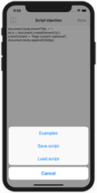  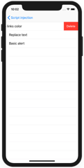 |
[Project 20](42-Project20) (with challenges)                                         UIBezierPath, SKAction follow, Emitter nodes                           | 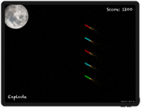 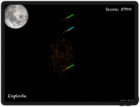  |
[Project 21](43-Project21) (with challenges 1 and 2)                                 Notifications, UNUserNotificationCenter, UNNotificationRequest           |    |
[Project 21 - Challenge 3](44-Project21-Challenge3) (base: project 2)                                                                                         |   |
[Milestone projects 19-21](45-Milestone-Projects19-21)                                                                                                        |   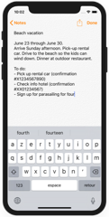   |
[Project 22](46-Project22) (with challenges)                                         iBeacons, Core Location, CLBeaconRegion                                  | 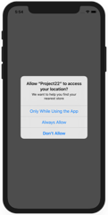 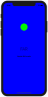 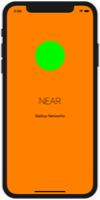 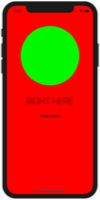 |
[Project 23](47-Project23) (with challenges)                                         SKShapeNode, AVAudioPlayer, CGPath, UIBezierPath, SKTexture              | 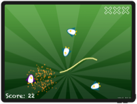 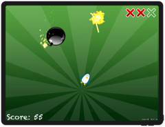 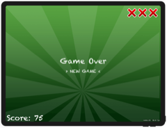 |
[Project 24](48-Project24) (with challenges)                                         Strings, NSAttributedString                                              | No screenshot |
[Milestone projects 22-24](49-Milestone-Projects22-24)                                                                                                        | No screenshot |
[Project 25](50-Project25) (with challenges)                                         Peer to Peer networking, MCSession, MCBrowserViewController, MCPeerID    | 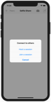 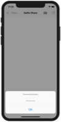 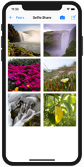   |
[Project 26](51-Project26) (with challenges)                                         Accelerometer, CMMotionManager, Load level from file, Physics Bitmasks   | 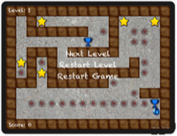 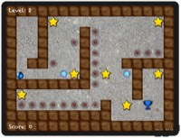 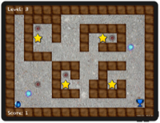 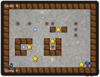 |
[Project 27](52-Project27) (with challenges 1 and 2)                                 Core Graphics, UIGraphicsImageRenderer, Fills and Strokes, Transforms    |   |
[Project 27 - Challenge 3](53-Project27-Challenge3) (base: project 3)                                                                                         |    |
[Milestone projects 25-27](54-Milestone-Projects25-27)                                                                                                        |    |
[Core Graphics redux](55-CoreGraphics-Redux)                                                                                                                  | No screenshot |
[Project 28](56-Project28) (with challenges 1 and 2)                                 Biometrics authentication, Touch ID, Face ID, iOS keychain               |     |
[Project 28 - Challenge 3](57-Project28-Challenge3) (base: project 10)                                                                                        |   |
[Project 29](58-Project29) (with challenges)                                         SKTexture, Filling a path, Mixing UIKit and SpriteKit, Texture atlases   |     |
[Project 30](59-Project30) (with challenges 1 and 3)                                 Instruments, Time Profiler, Allocations, Shadows, Table cells in code    |   |
[Project 30 - Challenge 2](60-Project30-Challenge2) (base: Milestone projects 1-3)                                                                            |   |

