# 100-days-of-swift

Solutions to Paul Hudson's "100 days of Swift" projects and challenges.

https://www.hackingwithswift.com/100

## Completion status

Type                | Number  | Completion
:---                |  :---:  |   :---:
Projects            | 30 / 30 | 100%
Challenges          | 90 / 90 | 100%
Milestone Projects  | 10 / 10 | 100%
Core Graphics redux |  1 / 1  | 100%

## Preview

*Within each project are larger versions of the screenshots.*

Projects / Topics                                                                                                                                                            | Screenshots
---                                                                                                                                                                          |---
[Project 1](01-Project1) - *Storm Viewer*  (with challenges)                                           View controllers, Storyboard, FileManager                                | 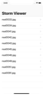  |
[Project 2](02-Project2) - *Guess the Flag*  (with challenges)                                           UIButton, CALayer, IBAction                                              | 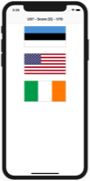 |
[Project 3](03-Project3) - *Social Media*  (with challenges)  (base: project 1)                        UIBarButtonItem, UIActivityController                                    | 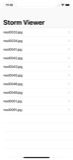 |
[Milestone projects 1-3](04-Milestone-Projects1-3) - *Country Flags*                                                                                                            |   |
[Project 4](05-Project4) - *Easy Browser*  (with challenges)                                           WKWebView, Action sheets, UIToolbar, UIProgressView                      |   |
[Project 5](06-Project5) - *Word Scramble*  (with challenges)                                           Reading from disk, UIAlertController, IndexPath                          |  |
[Project 6](07-Project6) - *Auto Layout*  (with challenges)                                         Auto Layout, Constraints, Visual Format Language                         |   |
[Milestone projects 4-6](08-Milestone-Projects4-6) - *Shopping List*                                                                                                            |  |
[Project 7](09-Project7) - *Whitehouse Petitions*  (with challenges)                                           UITabBarController, JSON, Data, Codable                                  |   |
[Project 8](10-Project8) - *7 Swifty Words*  (with challenges)                                           UI in code, Text alignment, Layout Margins, UIFont                       |  |
[Project 9](11-Project9) - *Grand Central Dispatch*  (with challenges)  (base: project 7)                                           Grand Central Dispatch, PerformSelector                                  |   |
[Milestone projects 7-9](12-Milestone-Projects7-9) - *Hangman*                                                                                                           |  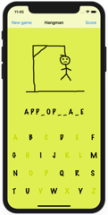 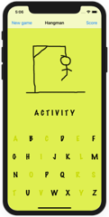  |
[Project 10](13-Project10) - *Names to faces*  (with challenges)                                 UICollectionView, UIImagePickerController, NSObject                      |  |
[Project 11](14-Project11) - *Pachinko*   (with challenges)                                        SpriteKit, Nodes, UITouch, Physics Body, SKAction, Collisions, Emitters  |  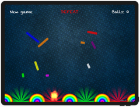 |
[Project 12](15-Project12) - *User Defaults*  (with challenges)   (base: project 10)                                     UserDefaults, JSON, NSCoding, Codable                                             | 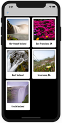 |
[Milestone projects 10-12](16-Milestone-Projects10-12) - *Photo captions*                                                                                                        | 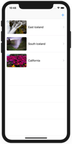 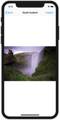 |
[Project 13](17-Project13) - *Instafilter*  (with challenges)                                         UISlider, UIImagePickerController, CIContext, CIFilter, Saving photos    |   |
[Project 14](18-Project14) - *Whack-a-Penguin*  (with challenges)                                         SKCropNode, SKTexture, SKAction                                          |  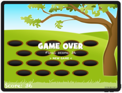 |
[Project 15](19-Project15) - *Animation*                                                           Animation, CGAffineTransform                                             |  |
[Milestone projects 13-15](20-Milestone-Projects13-15) - *Country facts*                                                                                                        |   |
[Project 16](21-Project16) - *Capital Cities*  (with challenges)                                         MapKit, MKMapView, MKAnnotation, CLLocationCoordinate2D                   |  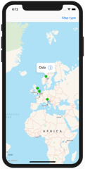  |
[Project 17](22-Project17) - *Space Race*  (with challenges)                                         Collisions, Timer, Linear / Angular damping                              | 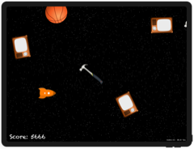  |
[Project 18](23-Project18) - *Debugging*                                                           Debugging                                                                | No screenshot |
[Milestone projects 16-18](24-Milestone-Projects16-18) - *Shooting Gallery*                                                                                                        | 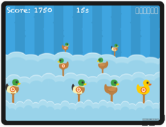 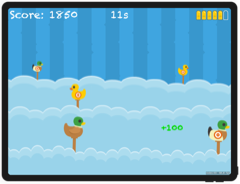  |
[Project 19](25-Project19) - *Javascript Injection*  (with challenges)                                         Safari Extensions, NSExtensionItem, UITextView, NotificationCenter       |     |
[Project 20](26-Project20) - *Fireworks Night*  (with challenges)                                         UIBezierPath, SKAction follow, Emitter nodes                           |   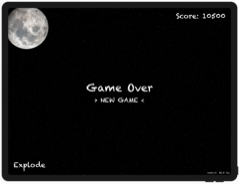 |
[Project 21](27-Project21) - *Local Notifications*  (with challenges)                                 Notifications, UNUserNotificationCenter, UNNotificationRequest           | 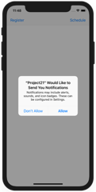 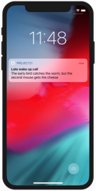 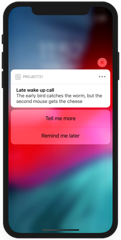 |
[Milestone projects 19-21](28-Milestone-Projects19-21) - *Notes*                                                                                                        | 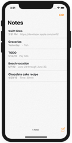 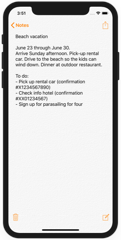    |
[Project 22](29-Project22) - *Detect-a-Beacon*  (with challenges)                                         iBeacons, Core Location, CLBeaconRegion                                  |   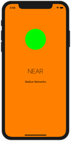 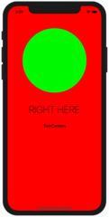 |
[Project 23](30-Project23) - *Swifty Ninja*  (with challenges)                                         SKShapeNode, AVAudioPlayer, CGPath, UIBezierPath, SKTexture              |    |
[Project 24](31-Project24) - *Swift Strings*  (with challenges)                                         Strings, NSAttributedString                                              | No screenshot |
[Milestone projects 22-24](32-Milestone-Projects22-24) - *Swift Extensions*                                                                                                        | No screenshot |
[Project 25](33-Project25) - *Selfie Share*  (with challenges)                                         Peer to Peer networking, MCSession, MCBrowserViewController, MCPeerID    |    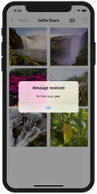  |
[Project 26](34-Project26) - *Marble Maze*  (with challenges)                                         Accelerometer, CMMotionManager, Load level from file, Physics Bitmasks   |  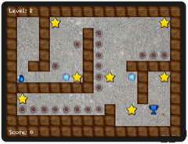  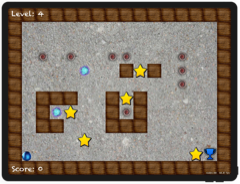 |
[Project 27](35-Project27) - *Core Graphics*  (with challenges)                                 Core Graphics, UIGraphicsImageRenderer, Fills and Strokes, Transforms    |   |
[Milestone projects 25-27](36-Milestone-Projects25-27) - *Meme Generator*                                                                                                       |  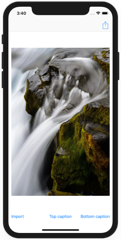 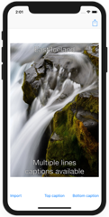 |
[Core Graphics redux](37-CoreGraphics-Redux)                                                                                                                  | No screenshot |
[Project 28](38-Project28) - *Secret Swift*  (with challenges)                                 Biometrics authentication, Touch ID, Face ID, iOS keychain               |  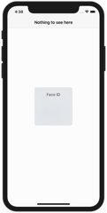   |
[Project 29](39-Project29) - *Exploding Monkeys*  (with challenges)                                         SKTexture, Filling a path, Mixing UIKit and SpriteKit, Texture atlases   |    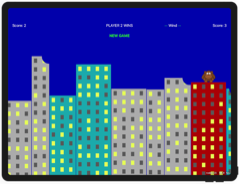 |
[Project 30](40-Project30) - *Instruments*  (with challenges)                                 Instruments, Time Profiler, Allocations, Shadows, Table cells in code    |   |
[Milestone projects 28-30](41-Milestone-Projects28-30) - *Match Pairs*                                                                                                       | 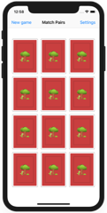 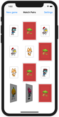    |
